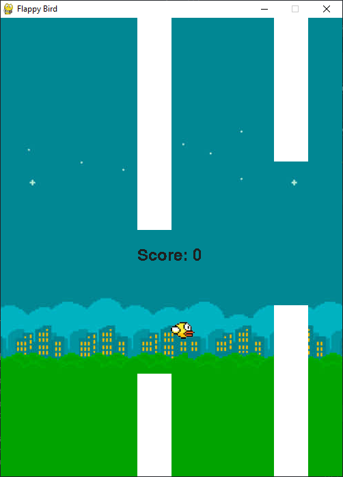

# Flappy Bird
The classic flappy bird game made in python with pygame. use your spacebar to flap the bird's wings. score resets if you hit a pipe.

# How to set up
either download the source code from the release and then the library from the `requirement.txt` file and then run the `main.py` file

# Exe
or if you want it a simpler way then just download the `game.exe` file and run it to play the game